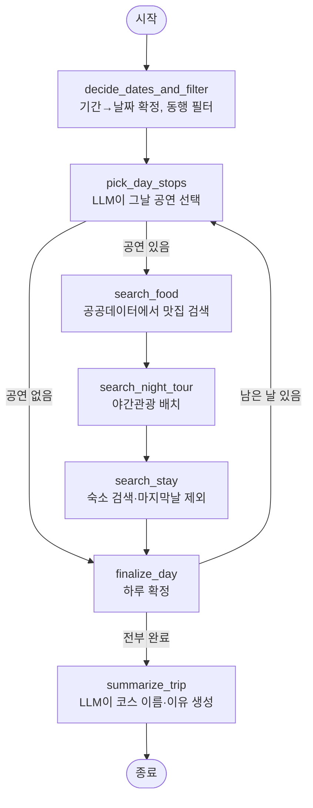

# 2026 전주세계소리축제 AI 코스 플래너

설문 5개에 답하면 **2026 전주세계소리축제의 실제 공연 일정**과 **전주시 공공데이터 음식점 정보**를 조합해, 시간이 겹치지 않는 나만의 여행 코스를 만들어주는 모바일 웹 앱입니다.

> 제25회 · 테마 「소리의 숨결, 모아 판으로」 · 2026년 8월 12일(수) ~ 8월 16일(일)
> 8개 분야 66개 프로그램 · 126회 공연

## 이 프로젝트의 핵심

LLM에게 "전주 여행 코스 짜줘"라고 물으면 **존재하지 않는 공연과 식당을 지어냅니다.** 이 프로젝트는 그 문제를 구조로 해결합니다.

- **공연** — 실제 축제 편성표 73개를 미리 정리해두고, LLM은 그 목록 **안에서 고르기만** 합니다 (tool의 `enum`으로 강제)
- **맛집** — 전주시가 공개한 음식점 인허가 데이터 11,844건에서 좌표 기반으로 직접 검색합니다 (LLM 관여 없음)
- **숙소** — Gemini의 Google Search 그라운딩으로 검색한 뒤, 그 검색 결과 텍스트에서만 정보를 추출합니다
- **시간표** — 겹침 판정과 빈 슬롯 배치는 전부 결정론적 코드가 담당합니다

즉 LLM은 **"선택"과 "설명"만** 하고, 사실 정보는 전부 실데이터에서 옵니다.

## 주요 기능

| 기능 | 설명 |
|---|---|
| 맞춤 설문 | 기간 · 방문 시간대 · 동행 · 이동수단 · 예산 5문항 + 야간관광 선택 |
| AI 코스 생성 | LangGraph 상태 그래프가 하루씩 루프를 돌며 1~3일 일정 구성 |
| 실제 맛집 배치 | 공연장 반경 내 실제 등록 음식점을 점심(11–15시)·저녁(17–21시) 빈 시간에 삽입 |
| 야간관광 연계 | 전주시 야간관광 프로그램을 20–23시 슬롯에 배치 (운영일에만) |
| 숙소 추천 | 1박 이상이면 마지막 일정 근처의 실존 숙소를 검색해 추천 |
| 도보 모드 | 이동수단이 도보면 반경 1.8km 밖 장소를 전부 제외 |
| 지도 표시 | 카카오맵으로 코스 동선 시각화 |

## 기술 스택

**프론트엔드** — React 19 · React Router 7 · Vite 6 · Oxlint · 카카오맵 JavaScript SDK

**백엔드** — Python 3.12 · FastAPI · LangChain · LangGraph · Google Gemini · pydantic-settings · uv

**배포** — Vercel (정적 프론트 + Python 서버리스 함수)

## 아키텍처

### 코스 생성 흐름 (LangGraph)



각 노드가 하는 일:

1. **decide_dates_and_filter** — `day`/`night1`/`night2` → 1/2/3일로 변환하고 축제 기간 내 연속 날짜를 잡습니다. 동행이 가족이 아니면 `kidsOnly` 프로그램을 후보에서 제외합니다.
2. **pick_day_stops** — 그날 실제 프로그램만 추려 LLM에 넘기고, `pick_day_stops` 도구 호출로 방문 순서를 받습니다. **stop id가 `enum`으로 고정**돼 있어 없는 공연을 만들 수 없습니다. LLM이 실패해도 시간순 정렬로 폴백합니다.
3. **search_food** — 점심·저녁 시각에 가장 가까운 공연장을 기준점으로 삼아, 반경 내 실제 음식점을 식당 1 + 카페 1로 뽑습니다. 매번 같은 결과가 나오지 않도록 근거리 후보 중 무작위 선택하고, 이미 쓴 이름은 제외합니다.
4. **search_night_tour** — 사용자가 고른 야간관광 중 **그날 실제 운영하는 것만** 20–23시 빈 슬롯에 넣습니다.
5. **search_stay** — 마지막 날이 아니면, Gemini Google Search로 마지막 일정 근처 숙소를 찾고 `report_stay` 도구로 구조화합니다. 다음 날의 동선 기준점이 됩니다.
6. **summarize_trip** — 완성된 일정을 보고 코스 이름과 추천 이유를 생성합니다.

### 겹침 없는 시간표를 만드는 방법

시간 배치는 LLM이 아니라 [`services/time_utils.py`](backend/app/services/time_utils.py)가 담당합니다.

- `overlaps()` — 두 일정의 시간 구간이 겹치는지 판정
- `dedupe_overlaps()` — 시간순 정렬 후 겹치는 뒷 일정을 버림
- `find_free_slot()` — 지정 구간을 15분씩 훑어 45분짜리 빈 자리를 탐색

### 거리 계산

`haversine_km()`으로 위경도 직선거리를 구하고, 도보 모드에서는 `MAX_WALK_KM = 1.8`을 넘는 후보를 잘라냅니다. 좌표가 없는 장소는 [Nominatim(OSM)](https://nominatim.openstreetmap.org)으로 지오코딩합니다 — API 키가 필요 없습니다.

## 프로젝트 구조

```
.
├── api/
│   └── build-course.py       # Vercel 서버리스 진입점 (backend/main.py 재노출)
├── backend/
│   ├── main.py               # FastAPI 앱
│   └── app/
│       ├── config.py         # pydantic-settings 환경변수 로더
│       ├── constants.py      # MAX_WALK_KM, 기간→일수 매핑
│       ├── api/routes.py     # POST /api/build-course
│       ├── graph/
│       │   ├── build.py      # LangGraph 그래프 정의
│       │   ├── nodes.py      # 노드 구현 (핵심 로직)
│       │   └── tools.py      # Gemini function calling 스키마
│       ├── models/
│       │   ├── schemas.py    # 요청/응답 Pydantic 모델 (camelCase 별칭)
│       │   └── state.py      # LangGraph 상태 TypedDict
│       ├── services/
│       │   ├── llm.py        # Gemini 클라이언트 · 도구 호출 · 검색 그라운딩
│       │   ├── restaurants.py # 음식점 CSV 파싱 · 필터
│       │   ├── food_search.py # 반경 검색 · 식당/카페 선정
│       │   ├── geocode.py    # Nominatim 지오코딩
│       │   ├── distance.py   # 하버사인 거리
│       │   ├── time_utils.py # 시간 겹침 · 빈 슬롯 탐색
│       │   └── festival_data.py # JSON 데이터 로더
│       └── data/
│           ├── stop_pool.json        # 축제 프로그램 73개
│           ├── venues.json           # 공연장 10곳 좌표
│           ├── survey_steps.json     # 설문 문항
│           ├── night_tour.json       # 야간관광 프로그램
│           └── jeonju-restaurants.csv # 전주시 음식점 공공데이터 (12,208건)
├── src/
│   ├── App.jsx               # 라우팅
│   ├── context/AppState.jsx  # 설문 답변 · 생성된 코스 전역 상태
│   ├── lib/aiRecommend.js    # 백엔드 API 호출
│   ├── screens/              # Home · Survey · CourseResults · AiCourse 등 7개
│   ├── components/           # KakaoMap · CourseTimeline · BottomNav 등
│   └── data/                 # 프론트용 정적 데이터
└── vercel.json
```

## 시작하기

### 사전 요구사항

- Node.js 18+
- Python 3.12+ 와 [uv](https://docs.astral.sh/uv/)
- API 키 2개 (아래 참고)

### 1. 저장소 클론 및 프론트엔드 설치

```bash
git clone https://github.com/northfacee/jeonju-sori-festival.git && cd jeonju-sori-festival && npm install
```

### 2. 백엔드 설치

```bash
cd backend && uv sync
```

### 3. 환경변수 설정

이 프로젝트는 API 키를 **하드코딩하지 않습니다.** 모든 키는 `.env`에서 읽으며, `.env` 파일은 전부 `.gitignore` 처리돼 있습니다.

**루트 `.env`** — `.env.example`을 복사해서 만듭니다.

```
VITE_KAKAO_MAP_KEY=여기에_카카오_JavaScript_키
```

[developers.kakao.com](https://developers.kakao.com)에서 애플리케이션 추가 후 **JavaScript 키**를 발급받고, **플랫폼 > Web**에 `http://localhost:5173`을 등록해야 지도가 뜹니다.

**`backend/.env`** — `backend/.env.example`을 복사해서 만듭니다.

```
GEMINI_API_KEY=여기에_Gemini_API_키
GEMINI_MODEL=gemini-3.7-flash

# LangSmith 트레이싱 (선택 · 비워두면 비활성화)
LANGSMITH_TRACING=false
LANGSMITH_API_KEY=
LANGSMITH_PROJECT=jeonju-sori-festival
```

[Google AI Studio](https://aistudio.google.com/apikey)에서 Gemini API 키를 발급받습니다.

> `VITE_` 접두사 변수는 Vite가 빌드 시 번들에 인라인하므로 브라우저에 그대로 노출됩니다. 카카오 JS 키는 원래 그런 키이며, 보호는 카카오 개발자 콘솔의 **서비스 도메인 등록**으로 합니다.

### 4. 실행

터미널 두 개가 필요합니다.

```bash
cd backend && uv run uvicorn main:app --port 8787 --reload
```

```bash
npm run dev
```

`http://localhost:5173`에서 확인할 수 있습니다. Vite dev 서버가 `/api` 요청을 `localhost:8787`로 프록시합니다.

> `config.py`가 현재 작업 디렉터리 기준으로 `.env`를 찾으므로, uvicorn은 반드시 `backend/` 안에서 실행해야 합니다.

## API

### `POST /api/build-course`

**요청**

```json
{
  "answers": {
    "duration": "night1",
    "time": "afternoon",
    "companion": "couple",
    "transport": "walk",
    "budget": "balanced",
    "nightTourIds": ["moonlight-pub", "yunseul-market"]
  }
}
```

| 필드 | 값 |
|---|---|
| `duration` | `day` (당일) · `night1` (1박2일) · `night2` (2박3일) |
| `time` | `morning` · `noon` · `afternoon` · `evening` |
| `companion` | `alone` · `friend` · `couple` · `family` |
| `transport` | `walk` · `transit` · `car` |
| `budget` | `saving` · `balanced` · `splurge` |
| `nightTourIds` | 야간관광 프로그램 id 배열 (선택) |

**응답**

```json
{
  "title": "한옥마을 소리 산책",
  "reason": "도보 이동을 선택하셔서 서로 1.8km 안에 있는 공연장 위주로 묶었어요...",
  "days": [
    {
      "dayNumber": 1,
      "date": "08-15",
      "dateLabel": "8월 15일(토)",
      "stops": [
        {
          "id": "...",
          "name": "개막공연",
          "time": "19:30",
          "timeEnd": "21:00",
          "kind": null,
          "venue": { "name": "한국소리문화의전당", "address": "...", "lat": 35.85, "lon": 127.13 },
          "desc": "..."
        }
      ]
    }
  ]
}
```

`kind`는 축제 공연이면 `null`이고, 앱이 추가한 일정이면 `food` · `cafe` · `night-tour` · `stay` 중 하나입니다.
축제 공연은 대신 `free`(무료 여부, 73개 중 무료 49개)와 `hall`(공연장 내 홀 이름)을 가집니다.

**에러**

| 코드 | 상황 |
|---|---|
| 400 | `answers` 누락 |
| 503 | `GEMINI_API_KEY` 미설정 |
| 500 | 그 외 생성 실패 |

## 데이터 출처

| 데이터 | 출처 |
|---|---|
| 축제 프로그램 · 공연장 | 2026 전주세계소리축제 공식 편성표 |
| 음식점 11,844건 | 전주시 공공데이터 「음식점 기본정보」 원본 12,208건 → 운영중·좌표 보유 건만 필터 (식당 8,863 · 카페 2,981) |
| 야간관광 프로그램 | [전주시 관광안내](https://tour.jeonju.go.kr) |
| 좌표 보정 | OpenStreetMap Nominatim |

음식점 데이터는 편의점 · 극장 · 유원지 · 백화점 · 출장조리 · 감성주점을 제외하고, 인허가 업종이 휴게음식점 · 제과점영업이면 카페로 분류합니다.

## 배포 (Vercel)

`vercel.json`이 `api/build-course.py`를 Python 서버리스 함수로 등록합니다.

```json
{
  "functions": {
    "api/build-course.py": { "excludeFiles": "**/.env", "maxDuration": 60 }
  }
}
```

- **`excludeFiles`** — 로컬 `.env`가 배포 번들에 포함되지 않도록 차단합니다. 따라서 Vercel 프로젝트 설정의 **Environment Variables**에 `GEMINI_API_KEY`와 `VITE_KAKAO_MAP_KEY`를 등록해야 합니다.
- **`maxDuration: 60`** — 여러 번의 LLM 호출과 지오코딩이 겹치므로 기본 제한으로는 부족합니다.

Gemini 클라이언트는 `max_retries=1`로 설정돼 있습니다. 기본값(6)이면 429 할당량 초과 시 SDK가 응답의 `retryDelay`를 그대로 존중해 재시도하다 함수 제한 시간을 넘겨 504로 죽기 때문에, 즉시 실패시키고 호출부의 폴백을 태웁니다.

## 알려진 제약

- 축제 편성표가 정적 JSON이라 실제 일정이 바뀌면 `stop_pool.json`을 갱신해야 합니다
- 무료 Gemini 티어에서는 하루 여러 번 생성 시 429가 날 수 있습니다 (이 경우 LLM 선택 단계가 시간순 정렬로 폴백)
- Nominatim은 요청 빈도 제한이 있어 대량 지오코딩에는 부적합합니다
